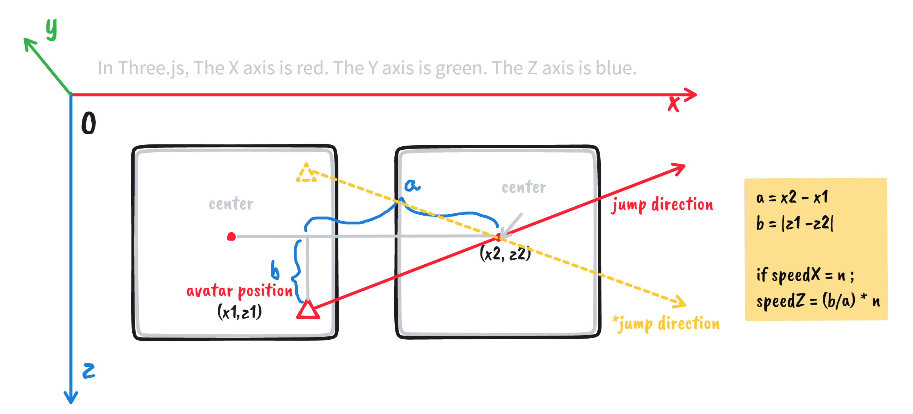

# Flip Jump - Threejs

中文 | [English](README_EN.md)

**在线预览： [https://dusktilldawn85.github.io/flip-threejs/](https://dusktilldawn85.github.io/flip-threejs/)**

基于`TypeScript`和`Three.js`实现的简易版跳一跳。

## 关键步骤

### 场景初始化 🧭

- 场景初始化 - `Scene`
- 光线初始化 - `Light`
- 相机初始化 - `Camera`
- 渲染器初始化 - `Renderer`

### 加载角色和方块 🧑‍🚀

### 生成随机距离、方向、颜色的格子 💭
简单的说就是基于`Math.random()`函数，将随机值映射至一个固定的区间内进行生成。

### 随分数增加难度递增 📈 - Todo


### 确定小人的跳跃方向 ⛳
经观察和实验发现游戏中小人的跳跃方向并不始终是**水平**或**垂直**的，需要根据当前的落点和下一个格子的中心点不断调整跳跃方向，示意图如下：



```javascript
// 核心逻辑
const aPos = this.avatar.avatar.position;  // 角色当前位置
const bPos = this.block.block.position;  // 下一格位置

// 确定下一个格子的方向
this.jumpDirection =
  bPos.x === this.block.blocks[this.block.blocks.length - 2].position.x ? "left" : "right";
// 计算校正速度
this.speedOffset =
  this.jumpDirection === "right"
    ? ((bPos.z - aPos.z) / (bPos.x - aPos.x)) * this.speedX
    : ((bPos.x - aPos.x) / (bPos.z - aPos.z)) * this.speedX;

if (this.jumpDirection === "left") {
  aPos.z -= this.speedX;
  aPos.x -= this.speedOffset;  // 校正
} else {
  // right
  aPos.x += this.speedX;
  aPos.z += this.speedOffset;   // 校正
}
```

## 功能结构


Cheers 🍻

