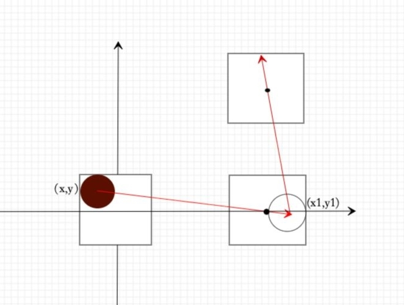
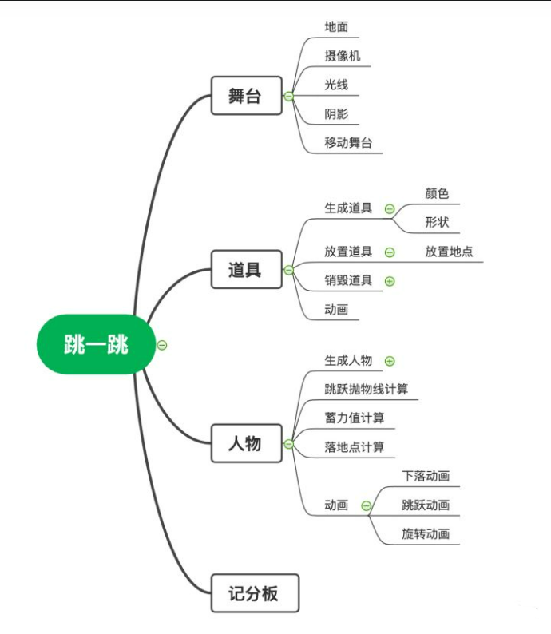

# Flip Jump - Threejs

中文 | [English](README_EN.md)

**在线预览： [https://dusktilldawn85.github.io/flip-threejs/](https://dusktilldawn85.github.io/flip-threejs/)**

基于`TypeScript`和`Three.js`实现的简易版跳一跳。

## 关键步骤

### 场景初始化 🧭
### 加载角色和方块 🧑‍🚀

### 生成随机距离、方向、颜色的格子 💭

### 确定小人的跳跃方向 ⛳
经观察和实验发现游戏中小人的跳跃方向并不始终是**水平**或**垂直**的，需要根据当前的落点和下一个格子的中心点不断调整跳跃方向，示意图如下：

## 功能结构

